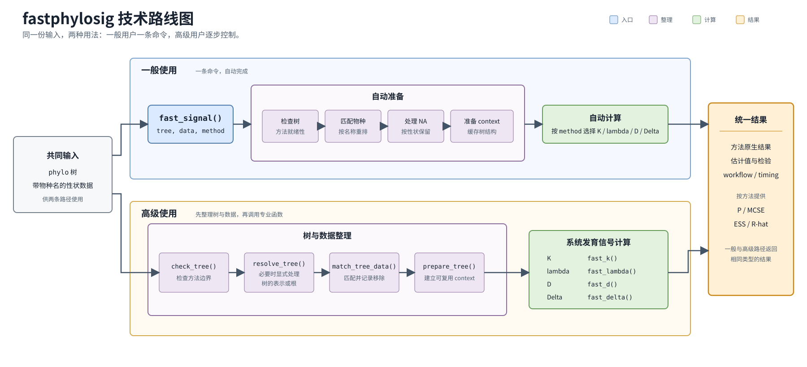

# fastphylosig 中文使用指南

`fastphylosig` 用于计算连续、二元和分类性状的系统发育信号。多数分析只需
使用 `fast_signal()`；需要逐步检查或调整方法参数时，再使用后面的专业函数。

## 安装

```r
install.packages("remotes")
remotes::install_github("yinwen-ecology/fastphylosig")
library(fastphylosig)
```

从源码安装需要 C++ 编译工具，OpenMP 为可选加速项。

## 最快用法：一个命令完成分析

准备好 `phylo` 树和带物种名称的性状数据后，选择方法并运行：

```r
set.seed(1)
tree <- ape::rtree(30)
trait <- setNames(stats::rnorm(30), tree$tip.label)

fit <- fast_signal(
  tree, data = trait, method = "K", progress = FALSE
)
summary(fit)
```

对于一般分析，这几行就够了。`fast_signal()` 会依次检查树、匹配物种、按性状
处理缺失值，然后执行所选的系统发育信号计算。

根据研究问题和性状类型选择 `method`：

| 目标 | `method` | 输入 | 主要结果 |
|---|---|---|---|
| Blomberg's K | `"K"` | 连续性状 | K，可选随机化检验 |
| Pagel's lambda | `"lambda"` | 连续性状 | lambda 似然和 LR 检验 |
| Fritz--Purvis D | `"D"` | 二元性状 | 随机零模型和 Brownian 零模型比较 |
| Delta | `"Delta"` | 分类性状 | Delta、MCMC 诊断和可选随机化检验 |

函数不会根据性状值猜测方法。可用 `print(fit)`、`summary(fit)`、
`as.data.frame(fit)` 或 `plot_signal(fit)` 查看结果；不适用于当前方法的参数会
直接报错。

## 分析流程



树和性状数据是两种用法的共同起点。一般用法由 `fast_signal()` 自动完成图中的
准备步骤；高级用法按相同顺序显式整理树和数据，再调用对应的 `fast_*` 函数。
网页可使用随包提供的 [draw.io 源文件](docs/technical-roadmap.drawio) 和
[Mermaid 源文件](docs/technical-roadmap.md)。

## 高级用法：先整理树和数据，再计算

需要保留清晰的整理记录，或使用方法专属参数时，可逐步运行：

```r
checked <- check_tree(tree, signal = "K")
checked

# 只处理安全的表示层问题；如果方法需要有根树而当前树无根，
# 必须由用户明确提供 outgroup。
tree_ready <- resolve_tree(tree, signal = "K")
matched <- match_tree_data(tree_ready, data = trait)
ctx <- prepare_tree(matched$tree)
```

完成整理后，直接调用对应的专业函数：

| 函数 | 适用性状 | 专属能力 |
|---|---|---|
| `fast_k()` | 连续 | 自定义置换、分块计算和零分布保存 |
| `fast_lambda()` | 连续 | 似然剖面和近似区间 |
| `fast_d()` | 二元 | 随机/Brownian 状态控制和零分布保存 |
| `fast_delta()` | 分类 | MCMC、随机化检验和链诊断 |

```r
fit_k <- fast_k(ctx, x = matched$data, test = TRUE, nsim = 999,
                return_sim = TRUE, progress = FALSE)
fit_lambda <- fast_lambda(ctx, trait, test = TRUE,
                          lambda_profile = TRUE, progress = FALSE)
binary <- setNames(as.integer(trait > stats::median(trait)), tree$tip.label)
fit_d <- fast_d(ctx, binary, test = TRUE, nsim = 99,
                return_sim = TRUE, keep_null = TRUE, progress = FALSE)
categorical <- setNames(rep(c("a", "b", "c"), length.out = 30),
                        tree$tip.label)
fit_delta <- fast_delta(ctx, categorical, test = TRUE,
                        mcmc_sim = 10000, thin = 10, burn = 100,
                        return_sim = TRUE, progress = FALSE)
```

`fast_ace()` 是 Delta 使用的离散祖先状态最大似然函数，主要面向需要直接检查
祖先状态估计的用户。

## 重复分析

```r
ctx <- prepare_tree(tree)
X <- cbind(trait_1 = trait, trait_2 = trait + stats::rnorm(length(trait)))
fits <- fast_signal(ctx, data = X, method = "K", verbose = FALSE)
cache_info(ctx)
```

prepared context 是创建时的快照：之后修改原始 `phylo` 对象不会更新它。
复用时，指纹会检查 context 内树的物种名称、边矩阵、枝长和 `Nnode`；
这些字段被修改后会拒绝复用。node labels 和其他不参与计算的属性不在当前
指纹范围内。
生产 K、lambda、D 和 Delta 路径不会仅因准备树而建立稠密协方差矩阵。

## 树与数据细节

`check_tree()` 只读。`resolve_tree()` 只在副本上处理边顺序和内部节点编号等
表示层问题；它不会猜测生物学根、选择外群、补造或抖动枝长、解析生物学
多分叉、超度量化树或静默删除物种。

- K 和 D 要求枝长有限且严格为正。D 可通过兼容路径处理有根多分叉，
  但不支持单子节点，包括匹配或逐性状剔除 NA 后暴露的单子节点。
- lambda 仅在变换后的末端方差仍有效时允许零内部枝，零末端枝会被拒绝。
- Delta 和 `fast_ace()` 要求常规有根、完全二叉且枝长严格为正。
- 根位置由用户提供，改变根可能改变统计结果。
- 当前不支持测量误差输入，即 `se` 必须为 `NULL`。

物种标识应为唯一的向量 names 或矩阵/data.frame row names。输入顺序无需与树
一致，匹配后会重排为树端点顺序。只有当未命名向量的元素或未命名表的行
本来就与 `tree$tip.label` 顺序一致时，才可以省略名称。缺失值在物种匹配后按性状处理。
如果省略名称时数据顺序实际不正确，程序无法自动识别这种位置错配，可能把性状
对应到错误的物种。

## 推断与诊断

K 随机化检验支持显式置换矩阵、分块计算和可选的零分布保存。D 分别报告
随机零模型和 Brownian 零模型的 P 值与 Bernoulli Monte Carlo 标准误
`MCSE_P_random`/`MCSE_P_Brownian`，分母为各自有限且成功的模拟数；
`test = FALSE` 时这些 MCSE 为 `NA`。D 只在 `return_sim = TRUE` 且
`keep_null = TRUE` 同时成立时保存两个 null 向量；两者的默认值分别为 `test` 和
`return_sim`。

Delta 默认包括 `test = FALSE`、`nsim = 1000`、`return_sim = test`、
`mcmc_sim = 10000`、`thin = 10`、`burn = 100` 和 `model = "ARD"`。因此，默认不计算
permutation P 值，也不保存 null。`test = TRUE` 时，`MCSE_P` 使用有限且成功的
置换次数；Delta 零分布的保存由 `return_sim = TRUE` 单独控制，Delta 没有
`keep_null` 参数。

全局共享物种少于 2 个时，Delta 整次调用报错。物种匹配后，某个性状因 NA 仅保留
少于 2 个物种时，返回该性状的 `insufficient_data` 结果；完成计算但只保留
2--19 个物种的性状会汇总为一次批量警告。解释结果时应联合检查 ESS、split R-hat、
`MCSE_Delta` 以及在存在时的 `MCSE_P`。警告不会自动重跑或延长链。

## 可重复性与性能

1. 多个性状使用矩阵一次传入，避免在 R 中逐列循环。
2. 重复分析时复用 `prepare_tree()` context。
3. 只在绘图或审计需要时保存 null 分布。
4. K 随机化、二叉树 D 和足够大的 Delta permutation 任务可使用 `ncores`。
5. `progress = FALSE` 只关闭进度阶段和物种匹配消息，统计警告和错误仍会正常发出；
   结果仍保留 timing 元数据。

要复现并行随机计算，需同时固定随机种子、显式模拟输入（如有）和 `ncores`。
改变 Delta 的进程数会重新分配并行随机数流，不能保证零分布及其 P/MCSE 逐次一致。
显式置换/状态矩阵可固定对应的随机化步骤，但 Delta MCMC 本身仍是随机的。

## 绘图

```r
plot_signal(fit_k)
plot_signal(fit_lambda)
plot_signal(fit_d)
plot_signal(fit_delta)
```

绘制零分布要求计算时保存模拟值：K 和 Delta 使用 `return_sim = TRUE`；D 需要
`return_sim = TRUE` 且 `keep_null = TRUE`。

## 版本兼容性

包声明支持 R 4.1.0 及以上版本。目前已在 Windows 的 R 4.6.1/Rtools 4.5 环境完成
本地源码包检查；这不代表已经完成全部跨平台验证。
