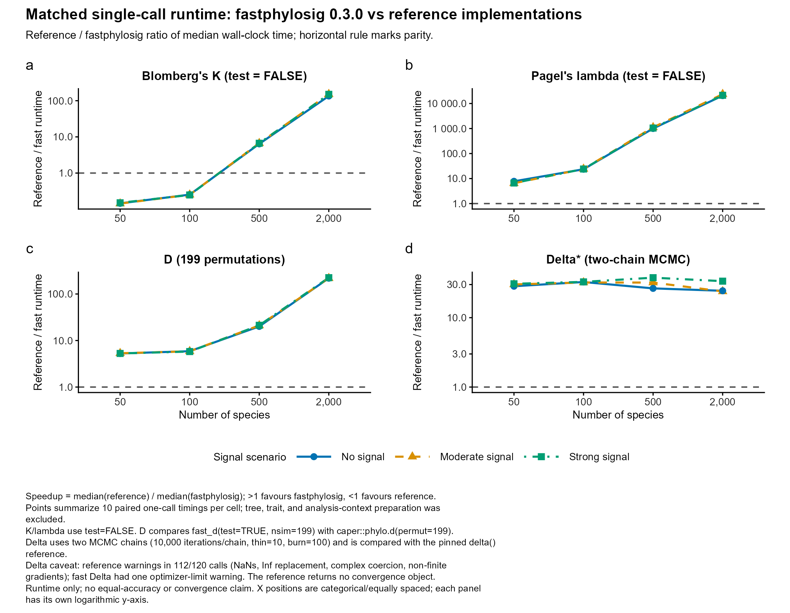
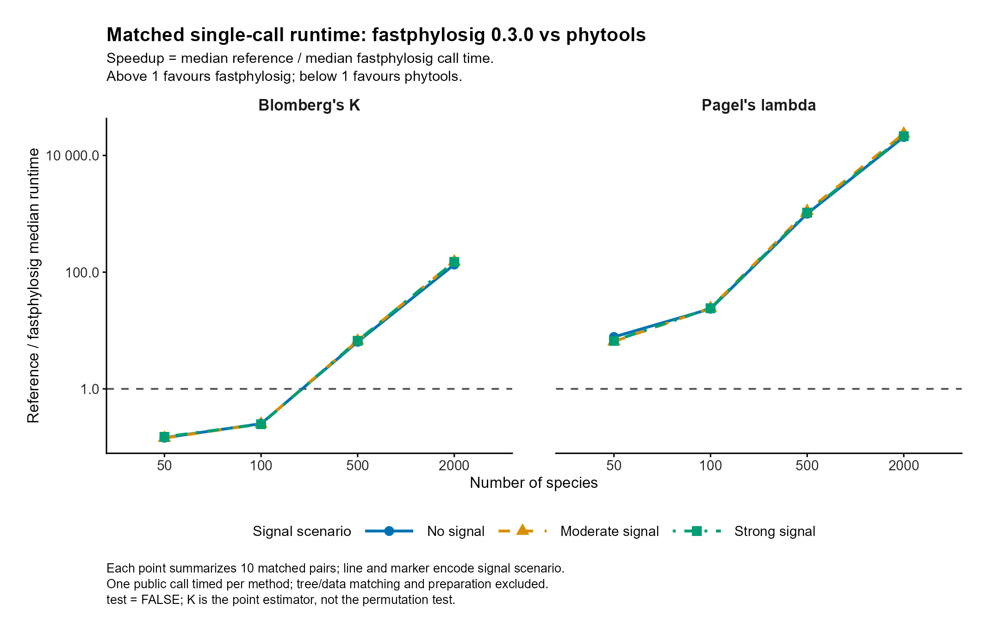

# fastphylosig 0.3.0 examples and performance

The frozen release is [v0.3.0](https://github.com/yinwen-ecology/fastphylosig/releases/tag/v0.3.0), source commit `0bf0c1520c42d3f0cefb359a8baa970897f3544a`.

This directory contains presentation material generated after release. It is excluded from the R source package by `.Rbuildignore`; updates here do not replace the validated release artifact or move its tag.

## Benchmark interpretation



The four-panel figure combines the completed 0.3.0 K/lambda run with the
completed D/Delta run: 480 matched pairs and 960 timed calls. No historical
0.1.0 or 0.2.0 timings are relabelled as 0.3.0.

| Species | K ratio | Lambda ratio | D ratio | Delta call-time ratio* |
|---|---:|---:|---:|---:|
| 50 | 0.143–0.151 | 6.48–7.76 | 5.27–5.33 | 28.39–30.78 |
| 100 | 0.248–0.253 | 23.57–24.28 | 5.79–5.90 | 32.13–32.79 |
| 500 | 6.41–6.67 | 1,004–1,115 | 20.11–21.24 | 26.43–37.69 |
| 2,000 | 134.91–151.40 | 20,697–23,591 | 218.20–224.09 | 23.89–33.58 |

Ratios are reference median divided by fast median. Ranges span the three
designed signal scenarios, not confidence intervals. References: phytools
2.5.2 for K/lambda, caper for D, and pinned Borges 2019 R code for Delta.
The workload differs by statistic: D includes 199 random/Brownian simulations
on both sides; Delta includes two 10,000-iteration chains (`thin = 10`,
`burn = 100`, `lambda0 = 0.1`, `proposal_sd = 0.5`, LSE entropy, ARD model),
without permutation testing. Context and caper comparative-data construction
are outside timing. D and Delta use discretized versions of the same simulated
continuous mixtures: median threshold for D and three rank-based classes for Delta.

*Delta diagnostic limitation:* 112/120 reference calls emitted numerical
warnings (NaNs, replacement of Inf, complex-to-real coercion or non-finite
gradients). All returned a finite Delta, but the reference wrapper exposes
only that number, not final ancestral-state fit convergence. One fast call
reached its transition-rate optimization iteration limit. No warned call was
removed or rerun. Thus Delta ratios are observed returned-call timings;
they do not establish equal accuracy, effective sampling or valid convergence.

The D/Delta full script completed all timed calls but exited with a
post-processing call-order-field error. Its original raw records were
preserved; derived pairs/summaries were reconstructed and audited without
repeating calls. Recovery provenance and warnings are disclosed in the QA.

- [Four-panel plotting code](plot_benchmark_four_methods.R) and [QA/diagnostic report](benchmark_reference_four_methods_qa.md)
- D/Delta [timed calls](benchmark_reference_d_delta_runs.csv), [pairs](benchmark_reference_d_delta_pairs.csv), [cell summaries](benchmark_reference_d_delta_summary.csv), [metadata](benchmark_reference_d_delta_metadata.csv), and [benchmark script](benchmark_reference_d_delta.R)
- [D/Delta diagnostics and recovery audit](benchmark_reference_d_delta_qa.md), [raw-record post-processing script](finalize_benchmark_reference_d_delta.R), and [clean four-panel source data](benchmark_reference_four_methods_source.csv)

To reproduce D/Delta, additionally obtain the external Borges comparator
from its [recorded upstream source](https://raw.githubusercontent.com/mrborges23/delta_statistic/master/code.R)
and place the byte-identical file at `paper/reference_sources/delta_borges2019_code.R`
in a separate working checkout. Required SHA-256:
`0dc1e987c13f0e972b0e7c3b4829b4d0fdc41ff0de3856bae4803f9ce0115175`.
The benchmark refuses a different file; upstream content may change. This
third-party comparator is not redistributed as part of fastphylosig.
With the validated tarball environment variable and isolated release library
described below, run `Rscript --vanilla docs/release-0.3.0/benchmark_reference_d_delta.R --profile full --library <isolated-library>`.
Use a separate checkout without existing result files; do not overwrite the
published evidence. Full comparison includes lengthy reference calls.

### K/lambda timing contract

The direct reference comparison uses the public `fast_k()` and `fast_lambda()` calls from 0.3.0 against `phytools::phylosig()` on identical complete tree/trait inputs. Fast functions receive a preconstructed single-column matrix, while phytools receives the equivalent named vector; values and species order are identical. The matrix output exposes actual retained/matched species counts for auditing. Tree generation, trait generation, matching, matrix construction, and fastphylosig context preparation occur before timing. Both implementations use `test = FALSE`: this measures K point estimation and lambda likelihood fitting, not permutation-test throughput.

The completed matrix has 50, 100, 500 and 2,000 tips; simulated Brownian/noise mixtures with weights 0, 0.5 and 0.95; and 10 paired tree/trait replicates per cell: 240 pairs and 480 timed calls. These are designed signal scenarios, not guarantees that every simulated trait attains a particular realized signal value. Speed ratio means reference elapsed time divided by fastphylosig elapsed time. Ratios below 1 are displayed as slower, not omitted.



| Species | K reference / fast median time | Lambda reference / fast median time |
|---|---:|---:|
| 50 | 0.143–0.151 | 6.48–7.76 |
| 100 | 0.248–0.253 | 23.57–24.28 |
| 500 | 6.41–6.67 | 1,004–1,115 |
| 2,000 | 134.91–151.40 | 20,697–23,591 |

Ranges span the three designed signal scenarios, not confidence intervals.
The largest ratio for both metrics occurred in the moderate scenario at
2,000 species: K, 3.188 s versus 0.02106 s (151.40); lambda, 626.694 s
versus 0.02656 s (23,591.44). K is slower than reference at 50 and 100
species. The unusually large lambda ratio should be read with its absolute
call times and the recorded reference/R versions; it is not a claim about
every implementation, hardware platform or workload.

### Data and reproduction

- [Cell summaries](benchmark_reference_summary.csv), [matched pairs](benchmark_reference_pairs.csv), [individual timed calls](benchmark_reference_runs.csv), and [version/hash/timing metadata](benchmark_reference_metadata.csv).
- [Benchmark R script](benchmark_reference.R), [plotting R script](plot_benchmark_reference.R), and [figure QA](benchmark_reference_qa.md).
- Download the validated source tarball from the [v0.3.0 release](https://github.com/yinwen-ecology/fastphylosig/releases/tag/v0.3.0), verify SHA-256 `909b7ad27485dcc2d96a7bb1fc70b65b54e93245d75761aca406b9c52f06cbff`, and install it into an isolated library. The default installed package is not used by the benchmark.
- In a separate checkout with an empty output directory (the scripts refuse to overwrite existing results), set `FASTPHYLOSIG_SOURCE_TARBALL` to that downloaded file. Run from the repository root: `Rscript --vanilla docs/release-0.3.0/benchmark_reference.R --library <isolated-library>`, then `Rscript --vanilla docs/release-0.3.0/plot_benchmark_reference.R`. Install the dependencies listed in those scripts into an available R library first.

One untimed pair warms up each metric/size before formal timing. Call order
alternates, giving five fast-first and five reference-first pairs per cell.
Every timer contains one public call; garbage collection and seed assignment
are outside the timer. The run was performed on Windows using R 4.6.1 and
phytools 2.5.2. Sub-millisecond small-tree reference K calls can be sensitive
to timer resolution; these results are descriptive rather than significance
tests. The summary also reports quartiles and paired ratios separately;
those paired-ratio summaries are not substituted for the plotted ratio of medians.

Independent 0.3.0-versus-0.2.0 permutation K performance evidence has a different workload and baseline and must not be multiplied into reference ratios. Timing results are descriptive and hardware-specific, not universal speed guarantees.

## Plotting examples

Examples use the actual `plot_signal()` implementation on reproducibly simulated demonstration data. They illustrate the output styles and are not empirical ecological findings or scientific validation of short example MCMC runs.


The [six-style gallery](plot_signal_gallery_QA.md) includes single-trait K, multi-trait K ridges, lambda profile likelihood, D random/Brownian calibration, separate D null displays, and categorical Delta permutation output. The [R script](plot_signal_gallery.R) recreates the data and all PNG/SVG/PDF exports using version 0.3.0.

The tree has 32 tips; K and D use 99 simulations. Lambda uses 101 profile points. Delta deliberately uses only 3 permutations and a short MCMC chain (`mcmc_sim = 60`, `thin = 10`, `burn = 20`); its ESS and split-Rhat warning is recorded in the gallery report. The Delta panel is explicitly not for inference, including its displayed Monte Carlo P value.

```r
k <- fast_k(tree, x, test = TRUE, nsim = 999,
            return_sim = TRUE, progress = FALSE)
plot_signal(k)

lambda <- fast_lambda(tree, x, test = TRUE,
                      lambda_profile = TRUE, progress = FALSE)
plot_signal(lambda)

d <- fast_d(tree, binary_trait, test = TRUE, nsim = 999,
            return_sim = TRUE, keep_null = TRUE, progress = FALSE)
plot_signal(d)                    # both nulls on the D scale
plot_signal(d, null = "random")  # select one null
```

Use named vectors (or matrices with species row names) matched to the tree. K/Delta distribution plots require retained simulations; lambda profiles are deterministic likelihood summaries, not permutation nulls. D displays two distinct calibrations and corresponding P values.

## Release boundaries

The 50K preparation mask-key limitation is deferred to 0.3.x. Release qualification is local Windows validation, not qualification on all platforms or CRAN acceptance.
