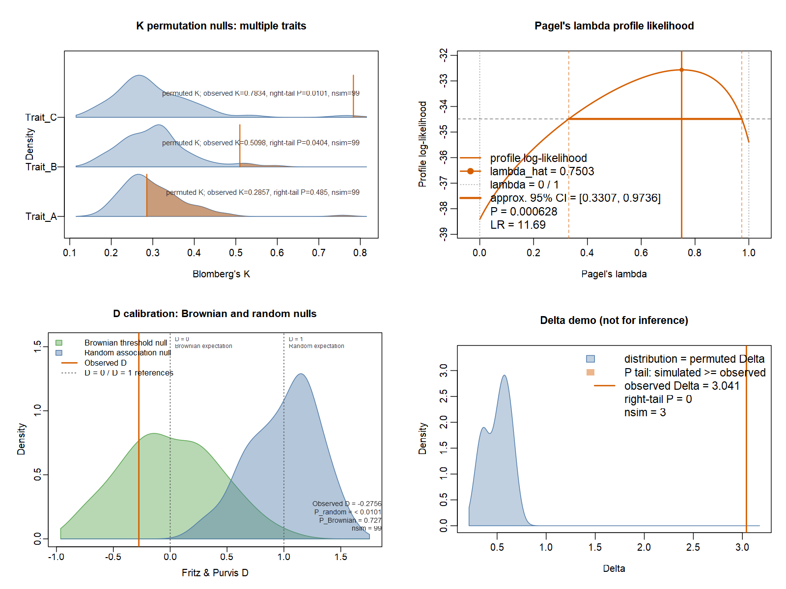
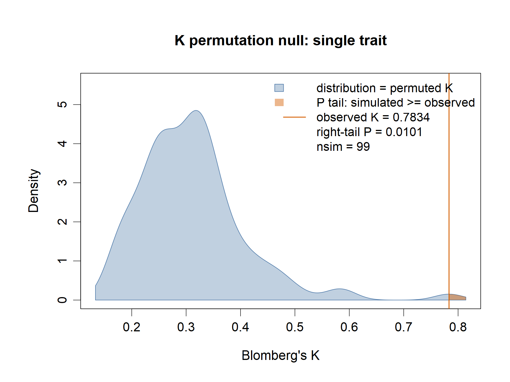
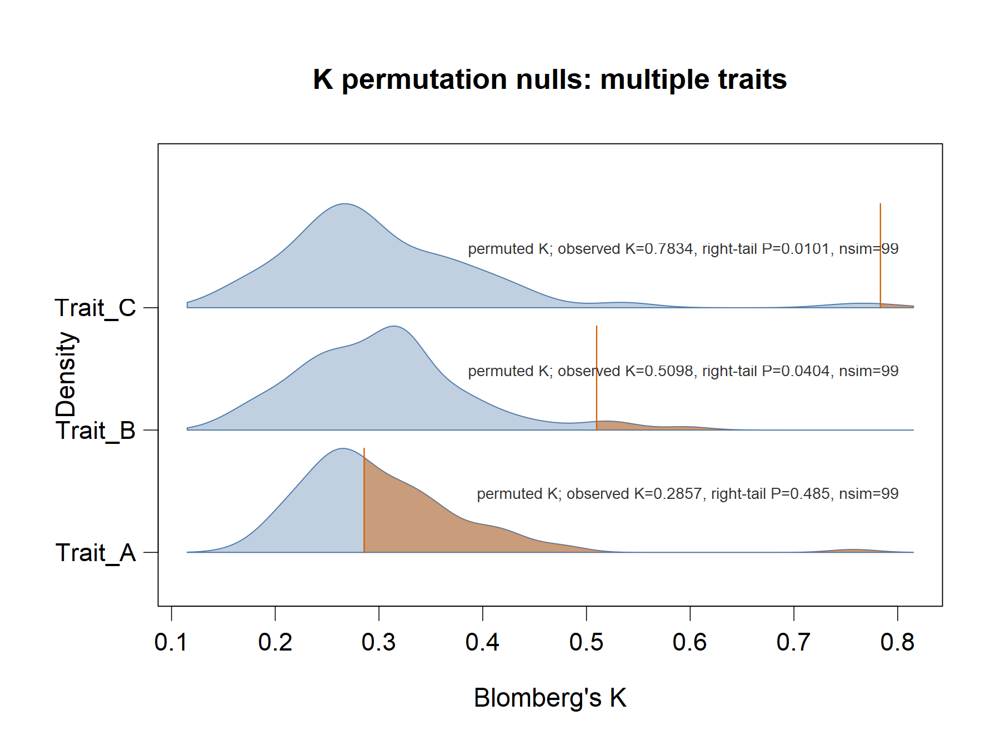
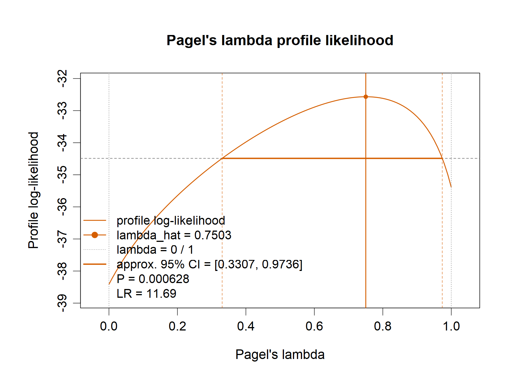
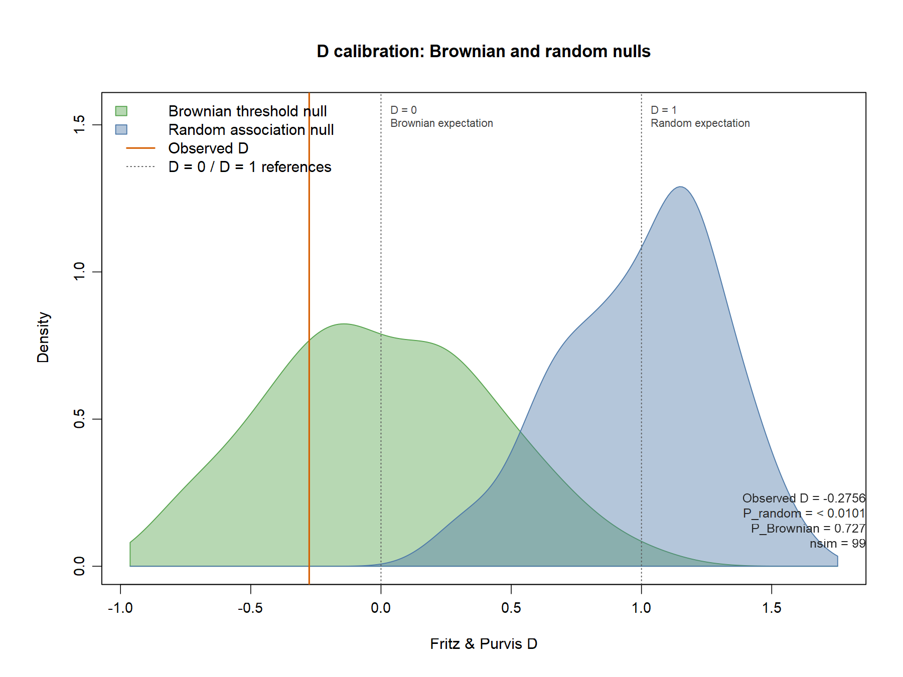
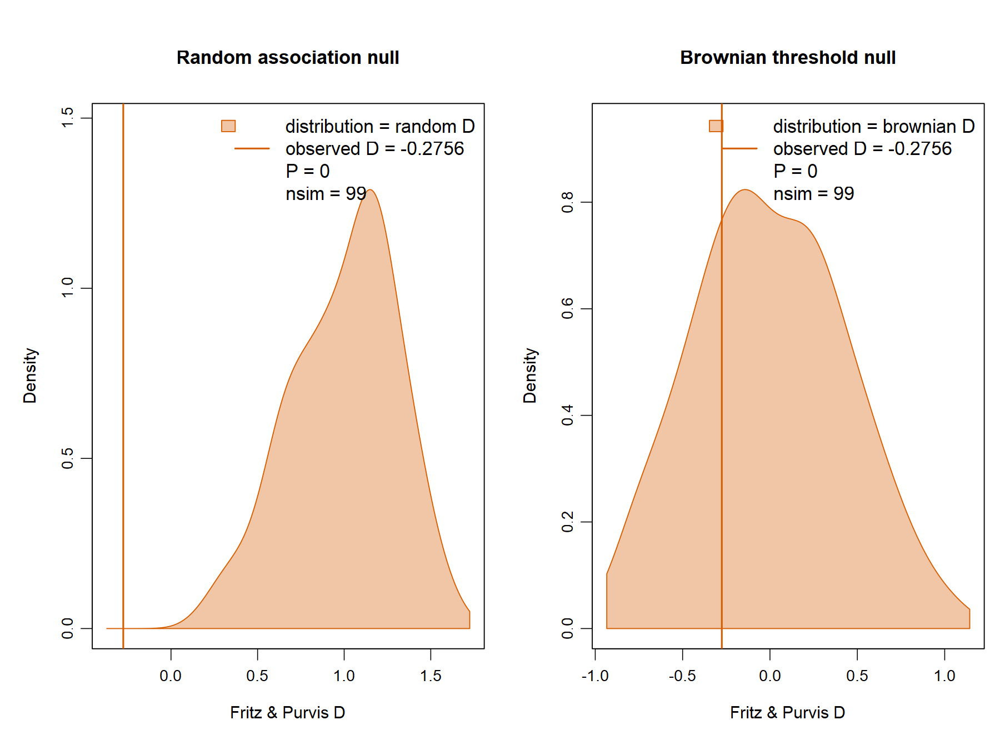
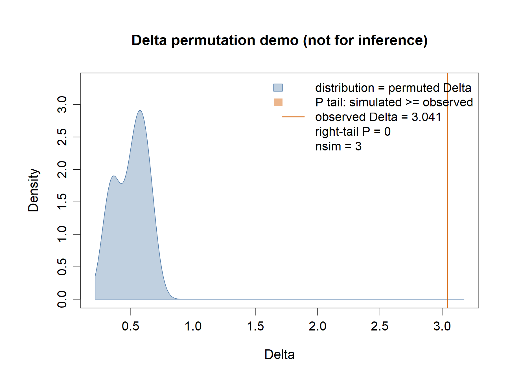

# plot_signal() gallery — fastphylosig 0.3.0

These are actual native `plot_signal()` outputs on simulated demonstration
data, not ecological findings. They show six display styles without changing
the released package implementation.

## Single-trait K

## Multiple-trait K

## Lambda profile likelihood

## D: random and Brownian calibrations

## D: separate null displays

## Categorical Delta

The Delta example uses only three permutations and a short MCMC chain;
its ESS/split-Rhat warning is retained. Neither the estimate nor the displayed
Monte Carlo P value should be used for scientific inference.

## Settings, reproduction and limitations

The demonstration tree has 32 tips. Data seed: 20261001; K/lambda seed:
20261002; D seed: 20261003; Delta seed: 20261004. K and D use 99 simulations;
lambda uses 101 profile points. Delta uses `mcmc_sim = 60`, `thin = 10`,
`burn = 20` and three permutations. No unsuccessful chain is rerun.

- [R generation script](plot_signal_gallery.R)
- [Demo tree](plot_signal_demo_tree.nwk), [traits](plot_signal_demo_traits.csv), [R data](plot_signal_demo_data.rds), [result summary](plot_signal_gallery_summary.csv)
- [Detailed QA and diagnostic caveats](plot_signal_gallery_QA.md)

Use an isolated installation of the released 0.3.0 package as described in
the script. PNG previews and editable SVG/PDF companions are provided here.
Some native statistical annotations overlap curves or reference lines, and
the overview has unequal plot-area margins. These are transparent examples
of the current plotting styles, not collision-free, submission-ready figures.

The [v0.3.0 release](https://github.com/yinwen-ecology/fastphylosig/releases/tag/v0.3.0)
and its validated tarball are unchanged. This directory is excluded from the
R source package; the 50K preparation limitation remains deferred to 0.3.x.
