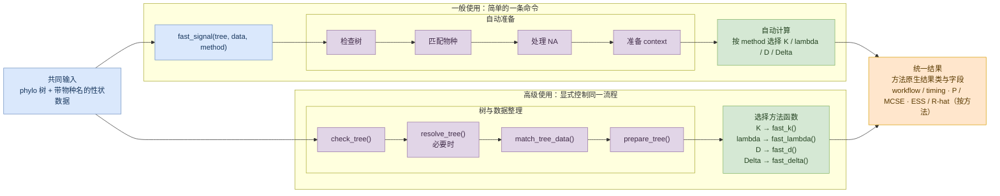

# fastphylosig 技术路线图

一般路径和高级路径按相同顺序排列：**输入 → 树与数据准备 → 系统发育信号计算 → 结果**。

- **一般使用**：只运行 `fast_signal()`，准备和计算均由包自动完成。
- **高级使用**：先显式检查和准备树与数据，再调用对应的方法函数。

网页若不启用 Mermaid，可直接使用同目录的
[`technical-roadmap.svg`](technical-roadmap.svg)；需要继续编辑时打开
[`technical-roadmap.drawio`](technical-roadmap.drawio)。
