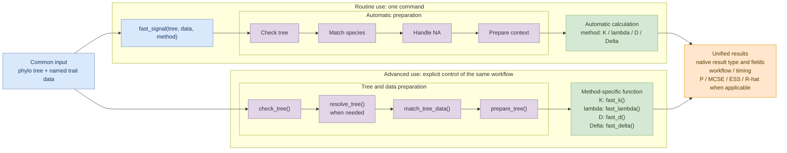

# fastphylosig technical roadmap

Routine and advanced use follow the same sequence: **input -> tree and data
preparation -> phylogenetic signal calculation -> result**.

- **Routine use** calls only `fast_signal()`; preparation and calculation are
  automatic.
- **Advanced use** prepares the tree and data explicitly, then calls the
  method-specific function.

The static page uses [`technical-roadmap.svg`](technical-roadmap.svg). The
editable source is [`technical-roadmap.drawio`](technical-roadmap.drawio).
